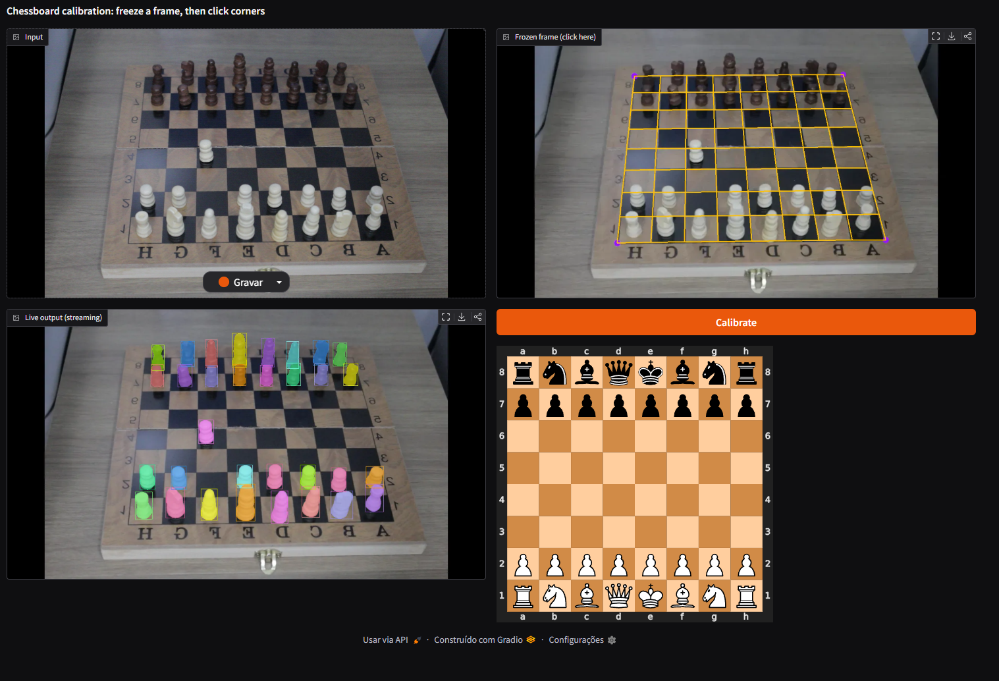

# Chess Piece Detection and Tracking

A real-time chess piece detection system using SAM3 (Segment Anything Model 3) and computer vision techniques for board calibration and piece tracking.



## Features

- 🎯 Real-time chess piece detection using SAM3
- 📐 Interactive chessboard calibration via perspective transformation
- 🔍 Piece movement tracking between frames
- 🎨 Visual annotations with bounding boxes and masks
- 🌐 Web interface powered by Gradio


### Prerequisites

- Python 3.11+
- CUDA-compatible GPU (optional, for faster inference)
- Docker (for dev container setup)


### Web Interface

```bash
python -m app.app
```

Navigate to `http://localhost:7860` to access the interface.

## Acknowledgments

- [SAM3](https://github.com/facebookresearch/sam3) by Meta Research
- [Supervision](https://github.com/roboflow/supervision) by Roboflow
- [python-chess](https://github.com/niklasf/python-chess) library
