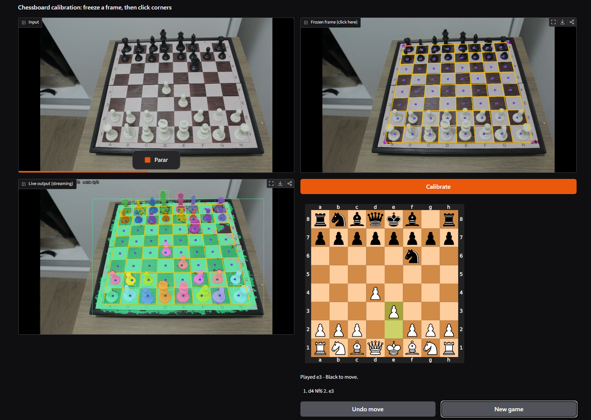

# Chess Piece Detection and Tracking

A real-time chess piece detection system using SAM3 (Segment Anything Model 3) and computer vision techniques for board calibration and piece tracking.



## Features

- 🎯 Real-time chess piece detection using SAM3
- 📐 Interactive chessboard calibration via perspective transformation
- 🔍 Piece movement tracking between frames
- 🎨 Visual annotations with bounding boxes and masks
- 🌐 Web interface powered by Gradio


### Prerequisites

- Docker with the NVIDIA container runtime (Docker Desktop + WSL2 on Windows)
- A CUDA-capable GPU
- A `.env` file with `HF_TOKEN` (copy `.env.example`), needed to download the SAM3 weights

### Running

```bash
cp .env.example .env   # then fill in HF_TOKEN
docker compose up --build
```

Navigate to `http://localhost:7860` to access the interface. The webcam is captured by the
browser, not by the container, so it works over that port.

Useful extras:

```bash
docker compose exec app bash                  # shell in the running container
docker compose run --rm app python run.py     # one-off run
docker compose run --rm --service-ports app   jupyter lab --ip 0.0.0.0 --port 7860        # notebooks
```

### Without Docker

Requires Python 3.11+ and a hand-installed SAM3 / CUDA torch stack:

```bash
pip install -e .
python run.py
```

## Acknowledgments

- [SAM3](https://github.com/facebookresearch/sam3) by Meta Research
- [Supervision](https://github.com/roboflow/supervision) by Roboflow
- [python-chess](https://github.com/niklasf/python-chess) library
